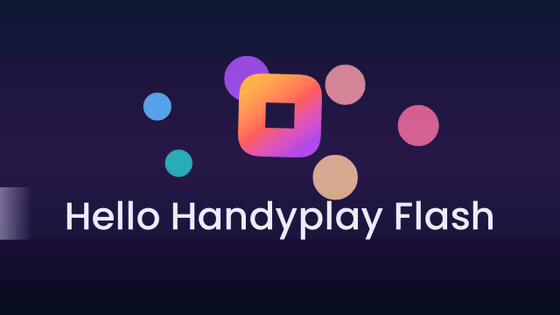
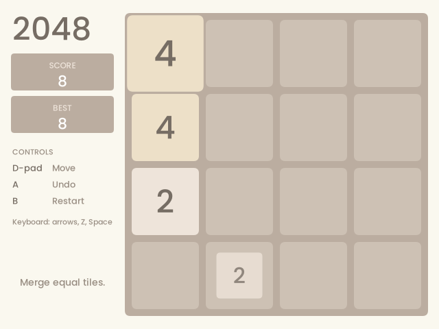
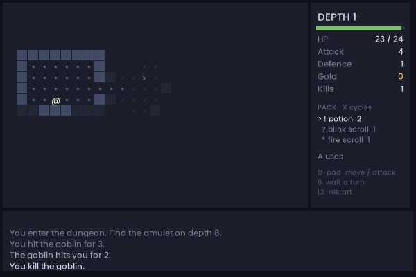

  

<h1 align="center">handyplay-flash</h1>

  <b>Plays old Flash games — including the phone ones nothing else can.</b> 
  A RetroArch core. No browser, no plugin, no Adobe anything.

  <a href="https://github.com/promentol/handyplay-flash/releases"><b>⬇ Download the core</b></a>

---

Flash is gone. The plugin was switched off at the end of 2020 and two decades
of games, cartoons and toys went dark with it. The `.swf` files still exist;
nothing on a modern machine will open them.

And **Flash Lite** — the version that ran on Nokia and Sony Ericsson phones —
is worse off still. It was never emulated at all. Those games have simply been
unplayable.

handyplay-flash plays both. It is a [RetroArch](https://www.retroarch.com)
core, so it runs wherever RetroArch runs: your desktop, a Raspberry Pi, or one
of the cheap ARM handhelds people already use for retro consoles.

Everything in the animation above is drawn by the movie itself — the gradient
sky, the glowing discs, the shine sweeping across the title. That is a real
Flash file, playing.

## Get it running

1. **Install [RetroArch](https://www.retroarch.com/?page=platforms)** if you
   do not have it.
2. **[Download the core](https://github.com/promentol/handyplay-flash/releases)**
   for your platform from the Releases page.
3. In RetroArch: **Load Core → Install or Restore a Core**, and pick the file
   you downloaded.
4. **Load Content**, choose a `.swf`, and play.

That is the whole setup. Controls configure themselves — see below.

> Building from source, the standalone desktop player, and the internals are
> all in **[DEVELOPERS.md](DEVELOPERS.md)**.

### Can I play without RetroArch?

There is a standalone desktop player — an SDL3 build that opens a `.swf`
directly — but you have to build it yourself. See
[DEVELOPERS.md](DEVELOPERS.md).

We are not shipping desktop downloads yet, and the reason is dull rather than
technical: packaging, signing, notarising and updating a desktop app across
three operating systems is continuous work, and it is not work this project
can take on right now. The better use of the same effort is getting the core
into the emulator apps that already do all of that — which is the plan.

### Can I play on iPhone or iPad?

Not yet, and it needs someone else's cooperation. iOS does not allow an app to
load native code it downloaded, so a libretro core cannot be a file you add
afterwards — it has to be compiled into the app itself. Once the core is
merged into RetroArch upstream, the iOS builds will carry it and it will just
be there.

There is also a new emulation app for iOS and Android on the way, which we
will have more to say about soon.

## Two games to try

Both ship with the core, written in ActionScript 2, source included — a fair
look at what the player can do.

| | |
|---|---|
|  | **2048** — tiles slide and merge, with score, best, and one step of undo. |
|  | **Delve** — a roguelike. Fresh dungeons every run, monsters that get nastier as you descend, permanent death. The amulet is on floor eight. |

## The controls sort themselves out

Flash games never agreed on controls. Some read the arrow keys, some read `Z`
and `X`, and the phone games only ever read the number keypad — because that
is all a Nokia had.

So handyplay-flash reads the game *before* it starts it, works out which keys
that particular game listens for, and maps the D-pad and buttons onto those.
You press up; the game gets whatever "up" means to it. Nothing to configure,
and every button is still remappable from the RetroArch menu.

## How it compares

|  | handyplay-flash | [Ruffle](https://ruffle.rs) | Adobe Flash Player | Adobe Flash Lite |
|---|---|---|---|---|
| Still available | yes | yes | no — ended 2020 | no — discontinued |
| Runs in a browser | no | **yes** | no longer | no |
| Runs as a RetroArch core | **yes** | no | no | no |
| ActionScript 1 & 2 | yes | yes | yes | a subset |
| ActionScript 3 | not yet | partly | yes | no |
| **Flash Lite phone games** | **yes** | no | no | yes |
| Save states & rewind | **yes** | no | no | no |
| Needs a GPU | no | usually | yes | no |

**Use Ruffle if** you want Flash back in your browser, or the game you care
about is a newer ActionScript 3 one. Ruffle is excellent and more complete
overall — this project treats it as the reference for correct behaviour.

**Use handyplay-flash if** you want Flash Lite phone games, or you want to
play in RetroArch with save states, on hardware with no graphics chip worth
speaking of.

## Why

### Why Flash Lite, and why the whole of ActionScript 1/2?

The original goal was narrower than what exists now: emulate **Adobe Flash
Lite**, which nothing else does. Flash Lite is a cut-down Flash, but not only
that — it added its own device commands for things a phone has and a PC does
not, and those are exactly what Ruffle has no reason to implement.

The plan was to build a cut-down player to match a cut-down runtime. That
turned out to be the harder road. Nokia and Sony Ericsson handsets each
exposed slightly different APIs, and every one of them was a *subset* of what
desktop Flash already did — so supporting the phones meant supporting a
shifting collection of subsets, while supporting all of ActionScript 1/2
meant implementing one thing once.

So that is what it does: the full ActionScript 1/2 surface, plus the Flash
Lite device commands on top. ActionScript 3 is a genuinely different engine
and is not here yet; it is the next direction, not a closed door.

### Why not just use Ruffle?

Ruffle is a better browser Flash player and this project does not pretend
otherwise. But it is built browser-first, and two of its foundations point
away from where this needed to go.

It renders on the **GPU**, which is the right answer in a browser and the
wrong one on a handheld with no dependable graphics driver. And a libretro
core is not a shape you can retrofit: the frontend drives it frame by frame,
owns the framebuffer, and expects the entire machine state to serialise and
restore exactly for save states and rewind. That is an architectural
commitment made at the start or not at all.

### Why draw with the CPU?

**It goes everywhere.** No graphics driver, no GL or Vulkan version to
require, no shaders to compile. Anything that can give us a rectangle of
pixels can run it.

**It is not slow.** The rasterizer is [simdra](https://github.com/promentol/simdra),
which is SIMD-accelerated — NEON on ARM, SSE on x86 — so the pixel work is
vectorised rather than looped.

**It makes strange platforms cheap.** A PS5, a Switch, anything with a
framebuffer and a C ABI: there is no graphics backend to port, because there
is no graphics backend. That is the whole reason to give up the GPU.

### Why Zig?

Choice of language is a holy war and there is no shortage of writing on it, so
only the reasons specific to *this* program:

- **SIMD is part of the language.** Vectors are a built-in type, not a pile of
  per-architecture intrinsics — which is what makes one rasterizer run fast on
  both ARM and x86.
- **It cross-compiles, including the C.** One command on a laptop produces the
  ARM core for a handheld, C dependencies and all, with no toolchain to
  assemble.
- **Allocators are explicit, and the standard library ships several.** Every
  allocation is passed one deliberately, which is precisely what makes a save
  state that restores byte-for-byte something you can actually test.

## Where it stands

The interpreter, graphics, text, images, sound, save states and the RetroArch
core all work, and it plays real games today. It is scored against Ruffle's
own public test suite: **679 of 680** pass. It is not finished — some visual
effects are missing, and there is no ActionScript 3.

## Game compatibility

This player is new, and Flash was a big, strange target with twenty years of
content behind it. Most things work. Some will not — a game that hangs on a
loading screen, art that draws wrong, a sound that never plays, a button that
does nothing.

**Please report them.** A broken game is useful information, and every one
that gets reported makes the next one more likely to work.
[Open an issue](https://github.com/promentol/handyplay-flash/issues) and say:

- **What game**, and where you got it — a link is ideal, the file itself if
  you are able to share it.
- **What happened, and what you expected instead.** "The screen stays black"
  beats "it doesn't work."
- **How to get there** — if it plays for two minutes and then breaks, say so.
  Bugs that need a specific move to trigger are the hardest to find and the
  most valuable to have described.
- **Where you are running it**: the platform, and which core version.

A screenshot of the wrong output helps more than almost anything else.

Fixes ship in batches roughly **once a week**.

## What's next

**Ship it with the handhelds.** Right now you download a core and install it
by hand. The goal is that you do not have to: submit to
[libretro-super](https://github.com/libretro/libretro-super) so the official
buildbot produces the core for every platform, then get it into the
distributions people actually run — **Batocera**, **ArkOS**, **muOS**,
**Knulli**, **RetroPie**, and the EmulationStation frontends they ship. Flash
should appear in the systems list next to the consoles, with the `.swf`
extension already associated and artwork that looks like it belongs.

**Make it easy to write new Flash games.** Flash was one of the great
approachable game-making tools, and the format did not stop being good just
because the plugin was withdrawn. The toolchain is already in this repository
— an ActionScript 2 compiler in a container, and two complete games with
heavily commented source. What is missing is the guide: how to lay a game out
for a handheld screen, how to pick key codes so the D-pad and buttons land
where you expect, what the renderer is fast at and what it is not.

That documentation is planned alongside **agent skills** — instructions that
let an AI coding assistant build a working Flash game for this core start to
finish, the way `samples/2048` and `samples/delve` were.

**ActionScript 3**, eventually. It is a different engine, so it is a real
project rather than an afternoon — but it is the direction, not a closed door.

## Thanks

[Ruffle](https://github.com/ruffle-rs/ruffle) for the reference and the test
suite · [open-flash](https://github.com/open-flash) for the documentation ·
[simdra](https://github.com/promentol/simdra) for the drawing ·
[minimp3](https://github.com/lieff/minimp3) for the sound ·
[Poppins](https://fonts.google.com/specimen/Poppins) for the text.

## License

AGPL-3.0 — see [LICENSE](LICENSE). Commercial licensing available separately.
